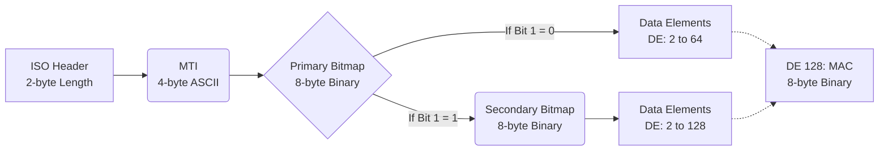
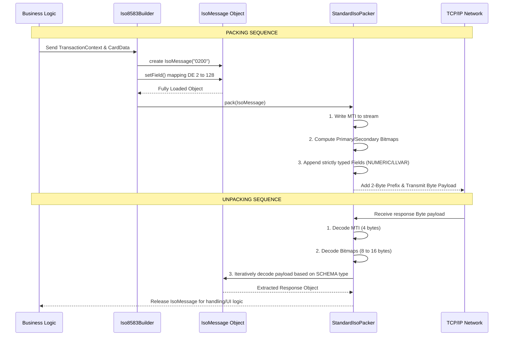

# ISO 8583 Technical Specification

This document provides a detailed technical overview of the ISO 8583 messaging implementation within the MySoftPOS Android application. The implementation is specifically tailored for the NAPAS Domestic CHIP switch and supports various card entry methods including Manual, Magstripe, and NFC Contactless.

---

## 1. Message Format and Architecture

The ISO 8583 serialization and deserialization flow adheres strictly to the Packed BCD and ASCII specifications.

*   **MTI (Message Type Identifier):** A 4-character ASCII string representing the message type (e.g., `0200`). Must be exactly 4 numeric digits.
*   **Bitmap (Data Elements Mapping):** 
    *   **Primary Bitmap:** 8-byte Binary covering Data Elements (DE) 1 to 64.
    *   **Secondary Bitmap:** Supported and automatically generated (8-byte Binary covering DE 65 to 128) if any field greater than 64 is present (indicated by setting the first bit of the Primary Bitmap).

### 1.1 Packet Structure Illustration

*   **Data Types and Length Strategies:**
    *   **`NUMERIC` (Fixed):** Right-aligned and left-padded with ASCII zeros (`0`).
    *   **`ALPHA` / `BINARY` (Fixed):** Left-aligned and right-padded with spaces (ASCII), or exact byte array alignment (Binary).
    *   **`LLVAR` (up to 99):** Variable length field prefixed by a 2-digit ASCII length indicator (e.g., `194123...`).
    *   **`LLLVAR` (up to 999):** Variable length field prefixed by a 3-digit ASCII length indicator. 
    *   **Note on DE 55 (ICC Data):** The DE 55 prefix is a 3-character ASCII LLLVAR length indicator that represents the *exact number of binary bytes* in the subsequent TLV stream, not the length of a hex string.

---

## 2. Technical Flow: Message Construction, Packing, and Unpacking

The Android application implements a structured, 3-phase pipeline to transition between high-level business logic and low-level byte arrays over TCP/IP: **Construction**, **Packing**, and **Unpacking**.

### 2.1 Packing and Unpacking Lifecycle Diagram

### 2.2 Message Construction (`Iso8583Builder`)
Transactions are initiated by constructing an `IsoMessage` wrapper class before any byte-level serialization occurs.
*   **Initialization:** The Builder instantiates a new `IsoMessage` object initialized with the correct MTI string (e.g., `"0200"`).
*   **Field Population:** The Builder injects business data elements utilizing the `setField(int fieldNumber, String value)` method. It aggregates parameters from the `TransactionContext` (e.g., Base Amount, STAN, Terminal configs) and `CardInputData` (e.g., PAN, Track 2, EMV Tags).
*   **Decoupled Logic:** The Builder does NOT concern itself with length prefixes or padding. It strictly handles the string/hex values. The packer handles truncation, length prefixes, and alignment later.

### 2.3 Packet Serialization (`StandardIsoPacker.pack()`)
Once the `IsoMessage` object is fully populated, the `StandardIsoPacker` generates the strictly formatted binary array payload for transmission.
1.  **MTI Byte Generation:** Extracts the 4-digit MTI and natively writes it to the output stream as 4 ASCII bytes.
2.  **Bitmap Computation:** 
    *   Iterates over the `IsoMessage` active KeySet to determine presence in DE 1 to 64. 
    *   If any key index `> 64` exists, bit 1 of the Primary Bitmap (`0x80` of the first byte) is flagged to `1`, and an additional 64-bit Secondary Bitmap is computed for DE 65-128.
    *   The 8-byte (or 16-byte) combined Binary Bitmaps are written to the stream.
3.  **Iterative Field Appending:** 
    *   The packer iterates sequentially from DE 2 up to 128. If a bitmap bit is evaluated as `TRUE`, it consults the static `SCHEMA` map to retrieve the `FieldDef` (Field Type and Maximum Length).
    *   **For `NUMERIC`:** The value is left-padded with ASCII `0` up to the fixed length.
    *   **For `ALPHA`:** The string is right-padded with ASCII spaces up to the fixed length.
    *   **For `LLVAR` / `LLLVAR`:** Evaluates the length of the string, converts the integer length into a `"02"` or `"003"` ASCII string prefix, and appends the prefix followed by the actual ASCII string/binary payload.
    *   **For `BINARY`:** Transcodes the builder's Hexadecimal string back into a pristine array of raw bytes (`byte[]`).

### 2.4 Message Deserialization (`StandardIsoPacker.unpack()`)
When the Terminal retrieves a byte stream payload from the Socket (after stripping the 2-byte Transport length header), the system reverses the structural mapping:
1.  **Read MTI:** Slices the first 4 bytes natively into an ASCII string to establish the new `IsoMessage` response object.
2.  **Bitmap Extraction:** Reads the subsequent 8 bytes to form the Primary Bitmap long primitive. It inspects bit 1; if set, it immediately consumes another 8 bytes for the Secondary Bitmap.
3.  **Field Parsing:** 
    *   The loop traverses from DE 2 to DE 128. By shifting the Bitmap bits (`(primaryBitmap >> (64 - field)) & 1`), the unpacker detects whether a designated DE is natively present.
    *   If present, the `SCHEMA` defines the byte consumption strategy:
        *   Fixed types (`NUMERIC`, `ALPHA`) consume a strict predefined byte size.
        *   Variable types (`LLVAR`, `LLLVAR`) explicitly consume the next 2 or 3 ASCII bytes to construct a pointer determining how many subsequent bytes must be pulled for the field value payload.
    *   The extracted strings or hexadecimal payloads are assigned using `setField()` on the incoming `IsoMessage`, ensuring it is instantly ready for UI or database translation.

---

## 3. Transport Layer Capabilities

Before transmitting the raw ISO 8583 byte stream over the TCP/IP network, the payload must be appropriately encapsulated.
*   **Length Prefix:** As defined in `IsoHeader.java`, the system utilizes the `withLengthPrefix2()` method to prepend a 2-byte big-endian length prefix to the payload. This header indicates the exact byte size of the payload, ensuring the backend socket receiver can accurately frame and parse the continuous TCP stream.
*   **TPDU Header (Optional):** The `withTpduHex()` capability permits the injection of a configurable 5-byte TPDU (Transport Protocol Data Unit) following the length prefix, which is essential for host routing in complex switch architectures.

---

## 4. Supported Transaction Types and Data Elements

### 4.1 Essential Identification Elements
To ensure accurate reconciliation and terminal identification, the following fields are strictly monitored and enforced:
*   **DE 41 (Terminal ID):** 8-character ASCII fixed field identifying the terminal.
*   **DE 42 (Merchant ID):** 15-character ASCII fixed field identifying the merchant.
*   **DE 37 (Retrieval Reference Number - RRN):** 12-character ASCII field utilized for referencing the transaction across its lifecycle (crucial for reversals and lookups).
*   **DE 38 (Authorization Code):** 6-character ASCII field returned by the host in the `0210` response to indicate grant of authorization.

### 4.2 Purchase Authorization (MTI `0200`)
The standard financial transaction.
*   **Processing Code (DE 3):** `000000`
*   **Mandatory Identifiers:** Automatically includes DE 4 (Amount), DE 11 (STAN), DE 12/13 (Local Time/Date), DE 19 (Country Code - `704`), DE 49 (Currency - `704`), DE 41, and DE 42.

### 4.3 Balance Inquiry (MTI `0200`)
Used to check account balances.
*   **Processing Code (DE 3):** `300000`
*   **Amount (DE 4):** Strictly initialized as `000000000000`.

### 4.4 Key Exchange (MTI `0800` / Logon)
*   **Logon/Initialization context:** To establish the cryptographic foundation, the terminal continuously executes a Network Management Request (`0800`).
*   **Key Hierarchy:** The Master Key (MK) securely resides within the terminal's hardware/secure enclave. The `0800` exchange downloads dynamic Working Keys—specifically the PIN Key (for DE 52) and the MAC Key (for DE 128).
*   **Payload Delivery:** The Working Keys are typically delivered by the host inside **DE 48** (Additional Data) or **DE 53** (Security Related Control Info), encrypted under the Master Key.
*   **Key Check Value (KCV):** Every transmitted key is accompanied by an analytical KCV. Upon decrypting the working key, the application recalculates the KCV (usually by encrypting a block of zeros `0x00...00` using the newly acquired key). The keys are permanently injected into memory only if the recalculated KCV matches the KCV sent by the host.

---

## 5. Response Processing and Offline Handling

### 5.1 Response Parsing (MTI `0210`, `0430`)
Upon receiving the response byte stream, `StandardIsoPacker` dismantles the ISO 8583 packet to analyze the response details.
*   **Response Code (DE 39):** A 2-character field determining the transaction outcome. The app interprets `00` as Approved. Other standard codes (e.g., `51` Insufficient Funds, `55` Incorrect PIN, `54` Expired Card) are mapped to localized, user-friendly UI alerts.
*   **Issuer Response Data:** Crucial EMV data returned from the host in DE 55 (Tag 91, Tag 71/72, Tag DF31) is passed directly to the NFC controller/chip to finalize the transaction cryptogram.

### 5.2 Reversal Advice (MTI `0420`)
Generated when a transaction times out or is explicitly rolled back.
*   **Original Data Elements (DE 90):** This is a mandatory 42-digit field constructed from the original message's properties: `Original MTI (0200)` + `Original STAN (6 digits)` + `Original Transmission Date/Time (10 digits)` + `Acquirer ID (11 digits)` + `Padding zeros (11 digits)`.
*   The original Amount (DE 4) and Track 2 data (if present) are preserved.

### 5.3 Store and Forward (SAF) Execution Parameters
When an `0420` Reversal cannot be immediately transmitted due to network unreachability, the transaction enters the **SAF (Store & Forward) Queue** managed by `SyncWorker.java` (using Android WorkManager and Room Database).
*   **Frequency and Limitations:** SAF tasks are scheduled on a periodic window (e.g., every 15 minutes) and are constrained by active Network Connectivity criteria. The system enforces a **maximum of 3 retries** per failed Reversal.
*   **Resolution Rules:** If the queue dispatcher intercepts a hard host rejection such as **Format Error (DE 39 = 30)** or **Message Not Supported**, the transaction is deemed unrecoverable. The retry increments are aborted, and the message drops from the queue to prevent infinite logic loops.
*   If after 3 transmission attempts the transaction remains unsuccessful (due to repetitive timeouts), it requires manual back-office reconciliation.

---

## 6. POS Entry Mode (DE 22) Routing Matrix

The message structure heavily depends on the Point of Service (POS) Entry Mode defined in DE 22:

| Entry Mode | Description | Required Fields | Excluded Fields |
| :--- | :--- | :--- | :--- |
| **011 / 012** | **Manual Entry** (Keyed) | DE 2 (PAN), DE 14 (Expiry) | DE 35 (Track 2), DE 55 (ICC) |
| **021 / 022** | **Magstripe** (Swiped) | DE 35 (Track 2), DE 14 (Expiry) | DE 55 (ICC Data) |
| **071 / 072** | **NFC Contactless** (CHIP) | DE 23 (Card Sequence), DE 55 (ICC) | **DE 35 (Track 2)**, DE 14 |

> [!WARNING]
> **Strict NAPAS Rule for NFC CHIP (071/072):** `DE 35` (Track 2) **must NOT** be present in the main ISO 8583 layout. Instead, Track 2 Equivalent Data is strictly encoded inside `Tag 57` within `DE 55`.

---

## 7. EMV and NFC Processing (DE 55)

The `EmvTlvCodec` orchestrates the complex BER-TLV encoding required for Contactless CHIP transactions.

### 7.1 Request Validation and Tag Assembly
A valid NFC DE 55 request must combine terminal-generated tags with card-generated tags. If any mandatory tag is missing, the transaction will be safely aborted.
*   **Terminal Generated (Mandatory):** 
    *   `9F02` (Amount Authorized), `9F03` (Amount Other - Zeros)
    *   `9F1A` (Country Code - 0704), `5F2A` (Currency Code - 0704)
    *   `9A` (Txn Date YYMMDD), `9C` (Txn Type `00` or `30`)
    *   `9F37` (Unpredictable Number), `9F33`, `9F34`, `9F35`, `9F09`, `95` (TVR).
*   **Card Generated (Required Overrides):**
    *   `57` (Track 2 Equivalent Data), `9F26` (Cryptogram ARQC), `82` (AIP), `9F10` (IAD), `9F36` (ATC).

### 7.2 Handling of Tag 57 (Track 2 Equivalent)
*   **Extraction:** Tag `5F34` (Card Sequence Number) provides the value for `DE 23`. If absent, `DE 23` falls back to `000`.
*   **Formatting Details:** Tag 57 is encoded in a semi-packed BCD format: 
    `PAN` + `D` (Separator) + `Expiry YYMM` + `Service Code (3 digits)` + `Discretionary Data` + `F (Trailing Padding for even nibbles)`.
*   **Validation:** The first digit of the Service Code in Tag 57 **must be `2` or `6`** to indicate a chip-capable card.

---

## 8. Cryptography and PCI-DSS Security Compliance

The application guarantees that sensitive cardholder data is securely processed and never printed in clear-text logs.

### 8.1 Field Masking (PCI-DSS Logging)
The `IsoMessage` class implements strict masking mechanisms:
*   **DE 2 (PAN):** Preserves the first 6 (BIN) and last 4 digits. The middle digits are redacted. Example: `970436******0001`
*   **DE 35 (Track 2):** Retains the PAN but masks everything following the `=` separator. Example: `970436******0001=*************`

### 8.2 PIN Block Encryption (DE 52)
For Online PIN transactions (e.g., Entry Mode `071`), the plaintext PIN entered by the user is securely encoded into a **16-character hexadecimal string** inside DE 52.
*   **Formatting Standard:** The encoding follows the **ISO 9564-1 Format 0** standard.
*   **Mechanism:** The operation securely XORs the Plaintext PIN Component against the PAN Component, generating a standard 8-byte PIN Block. This block is subsequently encrypted using 3DES (Triple DES) under the active **Working PIN Key** before external transmission. When logged, the string output is completely overwritten with asterisks (`****************`).

### 8.3 Message Authentication Code (MAC - DE 128)
To assure data integrity and guard against payload tampering, an 8-byte BINARY MAC is appended as the last field (DE 128 / DE 64).
*   **MAC Generation Algorithm:** The system utilizes the widely accepted **ANSI X9.9 (or ANSI X9.19) MAC** algorithm computed via symmetric 3DES cryptographic hashing using the downloaded **Working MAC Key**.
*   **MAC Data Block (Input Definition):** The payload string subjected to MAC computation strictly encompasses the ISO 8583 structural elements starting from the MTI frame. It fundamentally concatenates: `[MTI] + [Primary Bitmap] + [Secondary Bitmap (if present)] + [All Data Elements explicitly sorted up to DE 127]`.
*   **Verification Clause:** The Host recalculates the MAC using exactly the same sequential payload and key. If the local verification fails upon Host response matching, the application detects an integrity compromise and rigorously forces a Reversal `0420` injection to abort settlement procedures.
